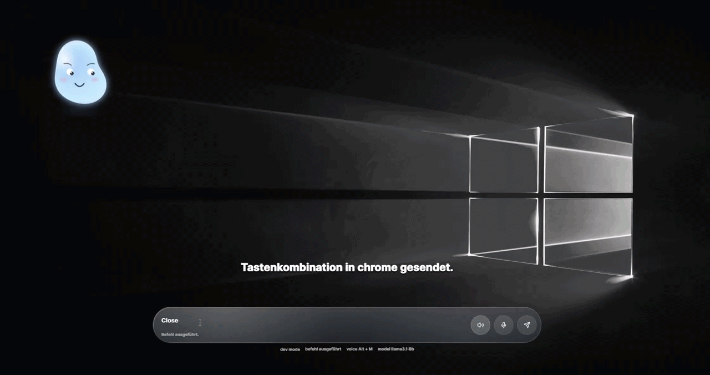

<div align="center">


# OpenBlob

**open-source desktop copilot for Windows**


</div>

---

> **Build a desktop copilot that feels alive, useful, extensible, and truly personal.** > <br />

<p align="center">
  
</p>

<p align="center">
  
</p>

<p align="center">
  
</p>

<br />
OpenBlob is a local-first AI companion that lives on your Windows desktop — sees your screen, understands your context, and grows through community-driven features, smarter abilities, better design, and new integrations.

---

## What is OpenBlob?

Most desktop assistants are too limited, too closed, too cloud-dependent, or too impersonal.

OpenBlob aims to be different:

- **open-source** — built in public, for everyone
- **local-first** — runs on your machine, not someone else's server
- **context-aware** — understands what app you're in, not just what you type
- **vision-enabled** — analyzes your screen in real time
- **privacy-conscious** — transparent about what touches the network
- **extensible** — designed for modules, plugins, and new capabilities
- **community-built** — welcoming to devs, designers, tinkerers, and curious builders
- **high-quality UX** — polished, expressive, and enjoyable to use

---

## Commands

OpenBlob understands natural language (German + English) and maps it to real system, browser, and AI actions.

Below is a snapshot of currently supported commands:

---

### 🌐 Browser & Web

| Command Example                      | Action           |
| ------------------------------------ | ---------------- | --- |
| `google nach wetter in berlin`       | Google search    | ✅  |
| `search google for best restaurants` | Google search    | ✅  |
| `youtube michael jackson`            | YouTube search   | ✅  |
| `play michael jackson on youtube`    | YouTube search   | ✅  |
| `open youtube`                       | Opens YouTube    | ✅  |
| `open google.com`                    | Opens URL        | ✅  |
| `öffne neuen tab`                    | New tab          | ✅  |
| `close tab` / `schließe tab`         | Close active tab | ✅  |
| `open new window`                    | New window       | ✅  |
| `go back` / `zurück`                 | Browser back     |
| `forward`                            | Browser forward  |
| `scroll down`                        | Scroll           | ✅  |
| `click first result`                 | Click result     | ✅  |
| `type hello world`                   | Type text        |
| `submit`                             | Press enter      |

---

### 🎬 Streaming & Content

| Command Example                   | Action          |
| --------------------------------- | --------------- | --- |
| `play something funny on netflix` | Recommendation  | ✅  |
| `open stranger things on netflix` | Open title      | ✅  |
| `more like this`                  | Similar content | ✅  |
| `next video`                      | YouTube next    | ✅  |
| `forward 10 seconds`              | Seek forward    | ✅  |
| `rewind`                          | Seek backward   | ✅  |

---

### 💻 System & Apps

| Command Example | Action            |
| --------------- | ----------------- | --- |
| `open vscode`   | Launch app        | ✅  |
| `open steam`    | Launch Steam      | ✅  |
| `close app`     | Close current app |
| `volume up`     | Increase volume   | ✅  |
| `mute`          | Mute system       | ✅  |
| `play music`    | Media control     | ✅  |
| `next track`    | Media next        |

---

### ✂️ Screenshot / Vision

| Command Example   | Action             |
| ----------------- | ------------------ | --- |
| `screenshot`      | Start snip mode    | ✅  |
| `take screenshot` | Capture            | ✅  |
| `mach screenshot` | German snip        | ✅  |
| `capture screen`  | Capture            |
| `explain this`    | Explain screenshot |
| `translate this`  | Translate text     |
| `search this`     | Generate search    |

---

### 🧠 AI / Context

| Command Example        | Action                      |
| ---------------------- | --------------------------- | --- |
| `what is this`         | Context explanation         | ✅  |
| `explain selection`    | Explain highlighted content | ✅  |
| `where am i`           | Page/app context            | ✅  |
| `what is on this page` | Page analysis               | ✅  |

---

### 🎮 Fun / Blob Interaction

| Command Example | Action               |
| --------------- | -------------------- | --- |
| `hide and seek` | Start mini game      | ✅  |
| `dance`         | Blob reacts to music | ✅  |
| `sleep`         | Blob idle mode       | ✅  |
| `wake up`       | Reactivate blob      | ✅  |

---

### ⌨️ Shortcuts

| Shortcut         | Action            |
| ---------------- | ----------------- | --- |
| `CTRL + SPACE`   | Toggle companion  | ✅  |
| `ALT + M`        | Voice input       | ✅  |
| `CTRL + ALT + S` | Screenshot / snip |

---

> Commands are fuzzy-matched — you don’t need exact wording.
>
> Example:  
> “search youtube for lo-fi beats”  
> “youtube lofi beats”  
> “play lofi beats”  
> → all resolve to the same intent.

## Features

### Current / in progress

| Feature                                                | Status |
| ------------------------------------------------------ | ------ |
| Desktop companion UI (transparent Tauri window)        | ✅     |
| Organic blob avatar with Framer Motion                 | ✅     |
| Emotional states (idle, thinking, love, sleepy, music) | ✅     |
| Petting interaction → heart mode                       | ✅     |
| Music-reactive dancing                                 | ✅     |
| Sleep / hide / wake states                             | ✅     |
| Voice + typed command routing                          | ✅     |
| Ollama local AI integration (multi-model)              | ✅     |
| Multi-model fallback system (vision + text)            | ✅     |
| Active window / app context detection                  | ✅     |
| Context-aware responses (games, apps, UI)              | ✅     |
| Screen capture + region snipping                       | ✅     |
| OCR, translation & explanation via screenshot          | ✅     |
| Vision-based search query generation                   | ✅     |
| Game UI / quest / error recognition via screenshot     | ✅     |
| Browser automation via Chrome/Edge remote debugging    | ✅     |
| Local app launching                                    | ✅     |
| Steam game detection & launching                       | ✅     |
| Input simulation (keyboard/mouse)                      | ✅     |
| Clipboard integration                                  | ✅     |
| Session memory for recent interactions                 | ✅     |
| Natural command parsing (German + English)             | ✅     |
| Speech bubble / companion bubble windows               | ✅     |
| Global shortcut: CTRL + SPACE to toggle UI             | ✅ ⚠️  |
| Hide & Seek mini game mode                             | ✅     |

> ⚠️ = feature exists but is still unstable or in active refinement

### Planned

- Settings UI
- Plugin / capability system
- Persistent long-term memory
- Structured reasoning / tool-based agent system
- More mini games and interactive blob modes
- Personality system with persistent character state
- Better onboarding experience
- Community skill packs
- More local model support
- Cross-platform exploration

---

## Known Issues / Rough Edges

| Area                                     | Status                                             |
| ---------------------------------------- | -------------------------------------------------- |
| Global shortcut (CTRL + SPACE)           | ⚠️ slightly unstable, WIP                          |
| Browser automation consent / permissions | ⚠️ needs clearer user controls                     |
| Multi-model routing                      | ⚠️ fallback logic still rough                      |
| Voice pipeline                           | ⚠️ occasional recognition failures                 |
| Context detection edge cases             | ⚠️ fallback to last known app isn't always correct |
| Error handling across modules            | ⚠️ inconsistent, needs improvement                 |
| Settings UI                              | ❌ not yet implemented                             |

> Expect rapid changes, rough edges, and ongoing refactors — this is early-stage, actively evolving software.

---

## Tech Stack

| Layer    | Technology                               |
| -------- | ---------------------------------------- |
| Frontend | React + TypeScript + Vite                |
| Desktop  | Tauri v2                                 |
| Backend  | Rust                                     |
| AI       | Ollama (multi-model orchestration)       |
| Vision   | gemma3 / qwen2.5vl / llama vision models |
| Motion   | Framer Motion                            |
| Platform | Windows 10 / 11                          |

---

## ⚠️ Security & Antivirus Notice

OpenBlob is a **local-first desktop application with deep system integration**.

Because of its capabilities, some antivirus or Windows security systems may flag or block parts of the application.

This is expected behavior due to:

- global keyboard shortcuts
- screen capture & snipping
- input simulation (keyboard / mouse)
- active window & process inspection
- browser automation (remote debugging)
- local AI execution

---

### What this means

- Windows Defender or other antivirus tools **may warn or block execution**
- SmartScreen may show **“unknown publisher” warnings**
- Some features (like browser control or input simulation) may be restricted

---

### What you can do

If you trust the project:

- allow the app through Windows Defender
- add an exclusion/whitelist for the OpenBlob directory
- ensure Chrome/Edge debugging port (9222) is not blocked
- run the app with sufficient permissions if needed

---

### Transparency

OpenBlob is:

- **open-source** — you can inspect everything
- **local-first** — no hidden cloud processing
- **explicit about system access**

No data is sent externally unless explicitly triggered (e.g. APIs or model calls you configure).

---

> ⚠️ Always review the code before running software that interacts deeply with your system.

---

## Getting Started

### Requirements

- Windows 10 or 11
- [Node.js](https://nodejs.org/)
- [Rust](https://rustup.rs/) + Cargo
- [Tauri prerequisites](https://tauri.app/v1/guides/getting-started/prerequisites)
- [Ollama](https://ollama.com/) installed locally
- Chrome or Edge (for browser automation features)

### Install dependencies

```bash
npm install
```

### Run in development

```bash
npm run tauri dev
```

### Build frontend only

```bash
npm run build
```

### Ollama setup

```bash
ollama serve
ollama pull llama3.1:8b
ollama pull gemma3
```

Optional — for vision features:

```bash
ollama pull qwen2.5vl:7b
```

> If your local model setup differs, adapt the model name in the app configuration or Rust backend.

---

## Project Structure

```
openblob/
├─ src/                          # React frontend
├─ src-tauri/
│  └─ src/
│     ├─ lib.rs
│     └─ modules/
│        ├─ command_router.rs    # intent parsing + routing
│        ├─ context.rs           # active window / app detection
│        ├─ screen_capture.rs    # screenshot + snip
│        ├─ snip_session.rs      # snip session management
│        ├─ browser_automations.rs
│        ├─ steam_games.rs
│        ├─ session_memory.rs
│        ├─ voice.rs
│        ├─ system.rs
│        ├─ windows_discovery.rs
│        └─ app_profiles.rs
├─ docs/
│  ├─ architecture.md
│  ├─ roadmap.md
│  └─ design.md
├─ .github/
│  ├─ ISSUE_TEMPLATE/
│  │  ├─ bug_report.md
│  │  └─ feature_request.md
│  ├─ workflows/
│  │  └─ ci.yml
│  └─ PULL_REQUEST_TEMPLATE.md
├─ .gitignore
├─ CHANGELOG.md
├─ CODE_OF_CONDUCT.md
├─ CONTRIBUTING.md
├─ LICENSE
├─ README.md
└─ SECURITY.md
```

---

## Philosophy

**1. Local-first**
Whenever possible, things run locally on the user's machine.

**2. Context > Prompt**
The assistant should understand your environment — what app you're in, what's on screen — not just what you type.

**3. Privacy-conscious**
Users should understand what runs locally, what accesses the browser, and what may call external services.

**4. Extensible by design**
New modules, commands, tools, and UI ideas should be straightforward to add.

**5. Community over gatekeeping**
This project welcomes contributions from developers, designers, tinkerers, AI enthusiasts, and curious builders.

**6. High-quality UX matters**
A desktop copilot should not just work — it should feel polished, expressive, modern, and enjoyable to use.

**7. Playful, but actually useful**
Fun interactions and real productivity are not opposites.

---

## Roadmap

### Core

- [ ] Stabilize command routing
- [ ] Improve app / context detection
- [ ] Improve browser automation reliability + consent handling
- [ ] Improve voice pipeline
- [ ] Add settings UI
- [ ] Better error handling across all modules

### AI / Intelligence

- [ ] Persistent long-term memory
- [ ] Better multi-model routing
- [ ] Structured reasoning pipeline
- [ ] Tool-based agent system

### Avatar / UX

- [ ] Richer blob behaviors and reactions
- [ ] Personality system (persistent character state)
- [ ] More emotional states and animations
- [ ] UI polish pass (glassmorphism, motion, feel)
- [ ] Cleaner onboarding

### Mini Games & Fun

- [ ] More mini game modes beyond Hide & Seek
- [ ] Score tracking / blob reactions to outcomes
- [ ] Interactive blob challenges (tap, race, puzzle)

### Platform

- [ ] Plugin architecture
- [ ] Capability registry
- [ ] Contributor extension guide
- [ ] Community skill packs

### Quality

- [ ] Tests
- [ ] Contributor docs
- [ ] CI improvements
- [ ] Release workflow

---

## Browser Automation

OpenBlob uses Chrome or Edge with remote debugging enabled for advanced browser interactions:

- reading current page context
- navigating in the active tab
- clicking visible links and buttons
- typing into inputs
- YouTube search and play helpers

> Browser automation is powerful — it remains transparent and user-controlled. Future versions will make permissions and consent handling even clearer.

---

## Screenshot / Vision Intelligence

OpenBlob can capture your screen or a selected region and reason about what it sees:

- OCR and text extraction
- Translation and explanation of on-screen text
- Game UI, quest log, and error recognition
- Automatic search query generation based on in-game content

> Example: screenshot a quest log → detect the game → extract the objective → build the perfect search query. All locally.

---

## Mini Games

OpenBlob has a growing interactive side beyond just being an assistant.

**Hide & Seek** — trigger via voice or text command. The blob hides somewhere on screen. You find it.

More game modes are planned as the project grows.

---

## Contributing

Contributions are welcome — all kinds, not just code.

| Area           | Examples                                                      |
| -------------- | ------------------------------------------------------------- |
| Code           | bug fixes, refactors, new commands, new modules               |
| Design         | avatar animations, UI/UX improvements, onboarding             |
| Docs           | architecture, guides, contribution ideas                      |
| Ideas          | new integrations, capability proposals, architecture feedback |
| Quality        | tests, CI, issue templates                                    |
| Mini games     | new game modes, interaction ideas                             |
| AI experiments | prompting strategies, model routing, agent ideas              |

Please open an issue before large changes so we can align on direction.

See [CONTRIBUTING.md](./CONTRIBUTING.md) for full details.

---

## Design Goals

OpenBlob should feel:

- **alive** — not static, reacts to context and what's on screen
- **smooth** — fluid motion, no jank
- **modern** — glassmorphism, soft motion, minimal clutter
- **non-intrusive** — stays out of the way when not needed
- **playful, but actually useful** — personality without sacrificing function

Design matters as much as functionality in this project.

---

## Status

**Early-stage, actively evolving.**

Expect rapid changes, rough edges, experimental ideas, and ongoing refactors. New features land frequently. Breaking changes happen.

---

## License

This project is licensed under the [MIT License](./LICENSE).

---

## Acknowledgements

Built with inspiration from:

- desktop companion applications
- local-first AI tools
- agent and automation systems
- modern interface design
- the open-source community

---

## Topics

`desktop-copilot` `tauri` `react` `rust` `ollama` `local-ai` `open-source` `desktop-assistant` `automation` `windows` `voice` `vision` `screenshot` `framer-motion` `mini-games` `context-aware`

---

<div align="center">

**OpenBlob is meant to grow.**

If you want to help shape the future of desktop copilots — you're invited.

⭐ Star the repo · 🐛 Open issues · 💡 Suggest features · 🛠 Contribute code

</div>
